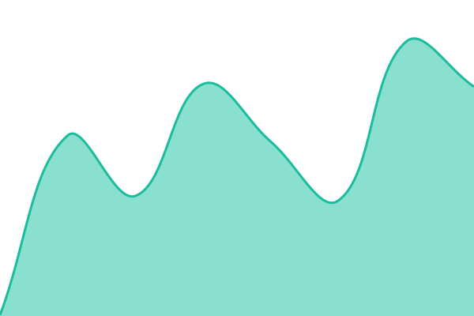
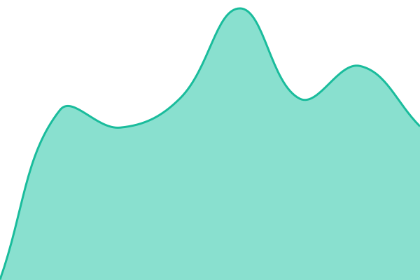
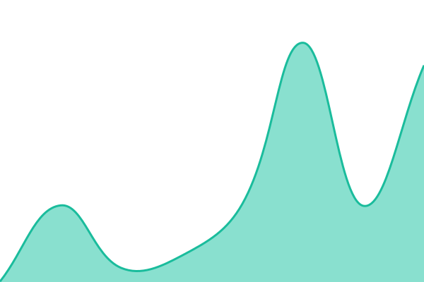
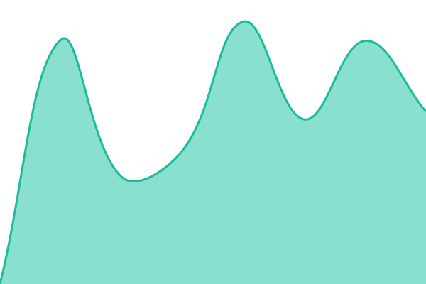

# [📈 Live Status](https://$STATUS_CNAME): <!--live status--> **🟩 All systems operational**

This repository contains the open-source uptime monitor and status page for [$OWNER](https://$STATUS_CNAME), powered by [Upptime](https://github.com/upptime/upptime).

With [Upptime](https://upptime.js.org), you can get your own unlimited and free uptime monitor and status page, powered entirely by a GitHub repository. We use [Issues](https://github.com/$OWNER/$REPO/issues) as incident reports, [Actions](https://github.com/$OWNER/$REPO/actions) as uptime monitors, and [Pages](https://$STATUS_CNAME) for the status page.

<!--start: status pages-->
<!-- This summary is generated by Upptime (https://github.com/upptime/upptime) -->
<!-- Do not edit this manually, your changes will be overwritten -->
<!-- prettier-ignore -->
| URL | Status | History | Response Time | Uptime |
| --- | ------ | ------- | ------------- | ------ |
|  主站 | 🟩 Up | [主站.yml](https://github.com/tar-shiro/scriptupptime/commits/HEAD/history/主站.yml) | 

 231ms
     
 | 

<a href="https://status.noshoka.org/history/主站">100.00%</a>
    

|  日榜 API + D1 | 🟩 Up | [api-d1.yml](https://github.com/tar-shiro/scriptupptime/commits/HEAD/history/api-d1.yml) | 

 78ms
     
 | 

<a href="https://status.noshoka.org/history/api-d1">100.00%</a>
    

|  CDN | 🟩 Up | [cdn.yml](https://github.com/tar-shiro/scriptupptime/commits/HEAD/history/cdn.yml) | 

 88ms
     
 | 

<a href="https://status.noshoka.org/history/cdn">38.89%</a>
    

|  Cloudflare API | 🟩 Up | [cloudflare-api.yml](https://github.com/tar-shiro/scriptupptime/commits/HEAD/history/cloudflare-api.yml) | 

 331ms
     
 | 

<a href="https://status.noshoka.org/history/cloudflare-api">100.00%</a>
    

|  B2 S3 API | 🟩 Up | [b2-s3-api.yml](https://github.com/tar-shiro/scriptupptime/commits/HEAD/history/b2-s3-api.yml) | 

 518ms
     
 | 

<a href="https://status.noshoka.org/history/b2-s3-api">100.00%</a>
    

|  GitHub | 🟩 Up | [git-hub.yml](https://github.com/tar-shiro/scriptupptime/commits/HEAD/history/git-hub.yml) | 

 229ms
     
 | 

<a href="https://status.noshoka.org/history/git-hub">100.00%</a>
    

|  Pixiv | 🟩 Up | [pixiv.yml](https://github.com/tar-shiro/scriptupptime/commits/HEAD/history/pixiv.yml) | 

 1283ms
     
 | 

<a href="https://status.noshoka.org/history/pixiv">100.00%</a>
    

|  Worker實例（備用） | 🟩 Up | [worker.yml](https://github.com/tar-shiro/scriptupptime/commits/HEAD/history/worker.yml) | 

 164ms
     
 | 

<a href="https://status.noshoka.org/history/worker">100.00%</a>
    

<!--end: status pages-->

[**Visit our status website →**](https://$STATUS_CNAME)

## 📄 License

- Powered by: [Upptime](https://github.com/upptime/upptime)
- Code: [MIT](./LICENSE) © [Anand Chowdhary](https://anandchowdhary.com)
- Data in the `./history` directory: [Open Database License](https://opendatacommons.org/licenses/odbl/1-0/)
